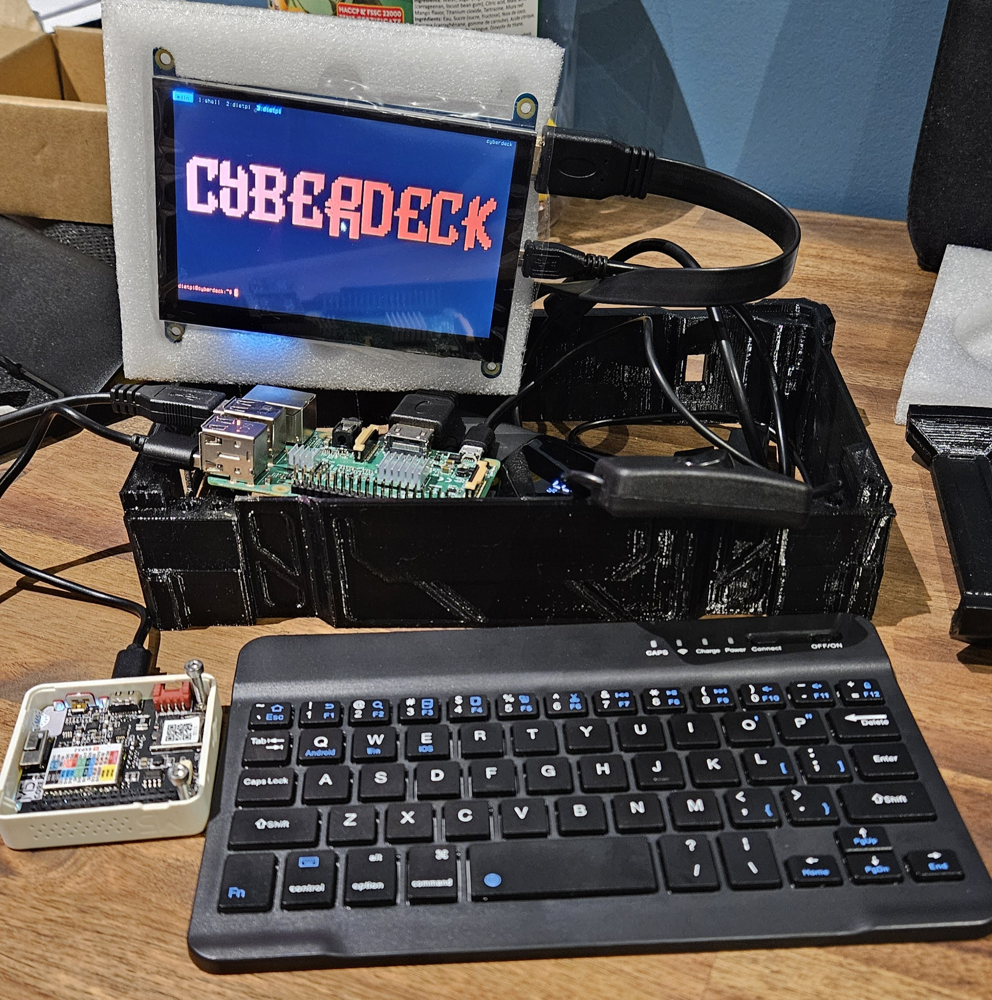

# CYBERDECK (WIP)

A custom handheld Linux cyberdeck built around a Raspberry Pi 3B. No desktop environment — just the terminal, the way it should be.

<p align="center">
  
</p>

---

## Overview

The cyberdeck is a portable, self-contained computing unit designed for terminal work, retro gaming, and general tinkering on the go. The hardware design is a custom 3D-printed case (modeled in Blender), housing all components in a compact cyberpunk-inspired form factor.

This repo contains the software stack: firmware, host scripts, and boot experience.

---

## Hardware

| Component | Details |
|---|---|
| **SBC** | Raspberry Pi 3B |
| **Display** | 5-inch HDMI touchscreen |
| **Stats display** | M5Stack M5GO Core1 (USB serial) |
| **Battery** | Rechargeable — powers the deck and includes USB output to charge phones |
| **Power** | Inline power switch |
| **Audio** | 4Ω 3W speaker + Bluetooth speaker support |
| **Prototyping** | Mini breadboard with exposed Raspberry Pi GPIO |
| **Case** | Custom design, modeled in Blender (WIP) |

---

## Software

| Component | Details |
|---|---|
| **OS** | [DietPi](https://dietpi.com/) — An extremely lightweight Debian OS |
| **Terminal** | foot + cage (Wayland) + tmux — autologin straight to terminal on boot |
| **Stats firmware** | PlatformIO firmware for M5GO Core1 — see [`CoreSerial/`](CoreSerial/) |
| **Stats sender** | Python script streaming system stats over USB serial — see [`CoreSerial/send_stats.py`](CoreSerial/send_stats.py) |
| **Gaming** | RetroArch (NES, SNES, PS1) |

---

## What's in this repo

```
cyberdeck/
├── CoreSerial/               # M5GO Core1 firmware + Pi-side stats sender
│   ├── m5core1_serial/       # PlatformIO firmware project
│   ├── send_stats.py         # Streams system stats over USB serial
│   └── requirements.txt
├── Setup/                    # Reproducible terminal environment setup
│   ├── setup.sh              # Run this on a fresh DietPi install
│   ├── start-terminal.sh     # Cage launch wrapper
│   ├── bash_profile          # Shell autostart template
│   ├── fonts/                # TerminessNerdFontMono TTF files
│   └── README.md             # Setup documentation
├── Splash/                   # Boot screen and ASCII art
│   ├── splash.sh             # Animated ASCII boot screen
│   ├── logo.txt              # ASCII logo (CYBERDECK)
│   └── cyberdeck.txt         # ASCII art (CYBERDECK CORE)
└── Case/                     # 3D-printed case design (Blender WIP)
```

### CoreSerial

The M5GO Core1 is mounted in the case and acts as a live stats dashboard. The Pi sends CPU usage, RAM, load averages, temperature, and network stats over USB serial at 115200 baud. The Core1 firmware renders this in a retro UI on its built-in LCD.

See [`CoreSerial/README.md`](CoreSerial/README.md) for setup and flashing instructions.

### Reproducible setup

To recreate the full terminal environment on a fresh DietPi install, see [`Setup/README.md`](Setup/README.md) and run:

```bash
bash ~/cyberdeck/Setup/setup.sh
```

### Boot experience

On power-on, tty1 autologs in as `dietpi` and immediately launches a Wayland kiosk session:

```
cage (Wayland kiosk) -> foot (terminal) -> tmux session "main"
                                             window 0: fastfetch, then bash
                                             window 1: CoreSerial stats sender (background)
```

No login prompt, no desktop, no MOTD — just the terminal.

---
## Use cases

- Portable Linux terminal
- Retro gaming (NES, SNES, PS1 via RetroArch)
- Portable battery bank (charge devices from the deck)
- Hardware prototyping via exposed GPIO
